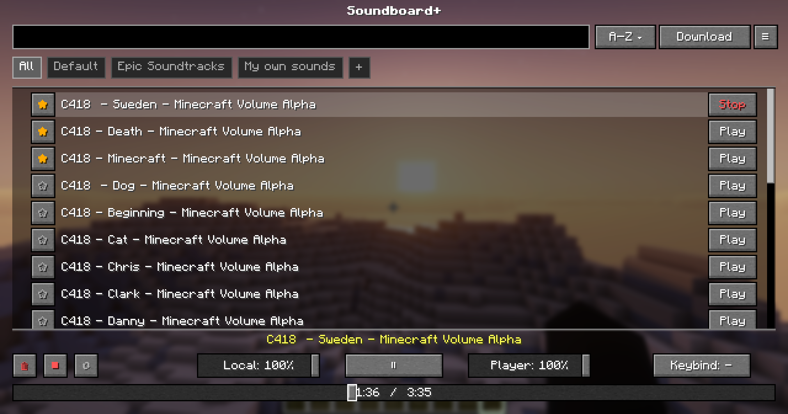

# Soundboard+

An enhanced soundboard mod for **Simple Voice Chat**, based on the original *Simple Soundboard* by kvxd.

> ⚠️ This project is a **fork** of Simple Soundboard, with additional features, improvements, and ongoing development.

***

## Overview

Soundboard+ lets you play `.mp3` files directly into your voice chat stream in-game. It includes a clean GUI, category management, and separate volume controls for yourself and other players.

***

## Features

- **MP3 Support** — Play standard `.mp3` files directly through voice chat.
- **Categories** — Organize your sounds into custom categories.
- **Built-in Downloads** — Uses [`yt-dlp`](https://github.com/yt-dlp/yt-dlp) to download audio from supported sources.
- **Dual Volume Controls** — **Player Volume** controls how loud others hear the sound; **Local Volume** controls how loud you hear it.
- **Hotkeys** — Bind hotkeys to individual sounds for instant playback.
- **Progress Bar** — Supports seeking and dragging to any point in a track.

### Addtional Features

- Rename sounds to keep your library organized
- Drag and drop sounds between categories
- Sort sounds on different filters
- Mark sounds as favourites for quick access
- Loop sounds for continuous playback

***

## Dependencies

- Fabric API
- Simple Voice Chat
- Fabric Language Kotlin

> The mod automatically downloads [`yt-dlp`](https://github.com/yt-dlp/yt-dlp) and [`ffmpeg`](https://github.com/BtbN/FFmpeg-Builds).

***

## Getting Started

### 1. Generate Folders

- Launch the game once

### 2. Add Sounds

- Open `Download` tab
  - Download a Song from almost every source
  - Open the soundboard directory and drag & drop `.mp3` files into the director

### 3. Use In-Game

- Join a world or server
- Press **`J`** (default keybind) to open the GUI
- Double-click a sound or click **Play** to start it

***

## Configuration

Access settings via the **Config** button in the GUI:

- **Play while Muted** — Toggle whether sounds play while your mic is muted
- **No overlapping sounds** — Toggle whether a new sound stops the currently playing one
- **Show Progress Bar** — Toggle visibility of the progress bar
- **Save Last Category & Page** — Save the last Category you opened

***

## Credits

- **kvxd** — Original creator of *Simple Soundboard*
- **Wolmics** — Soundboard+ (this fork)

Based on: [https://github.com/0x1bd/SimpleSoundboard](https://github.com/0x1bd/SimpleSoundboard)

***

## License

Licensed under **GPL-3.0**, keeping the project open-source and preserving original attribution.

***

## Notes

Soundboard+ aims to expand and improve upon the original mod while staying simple, lightweight, and easy to use. If you have suggestions or run into any issues, feel free to open one on the repository.